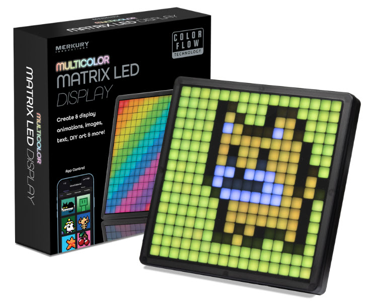
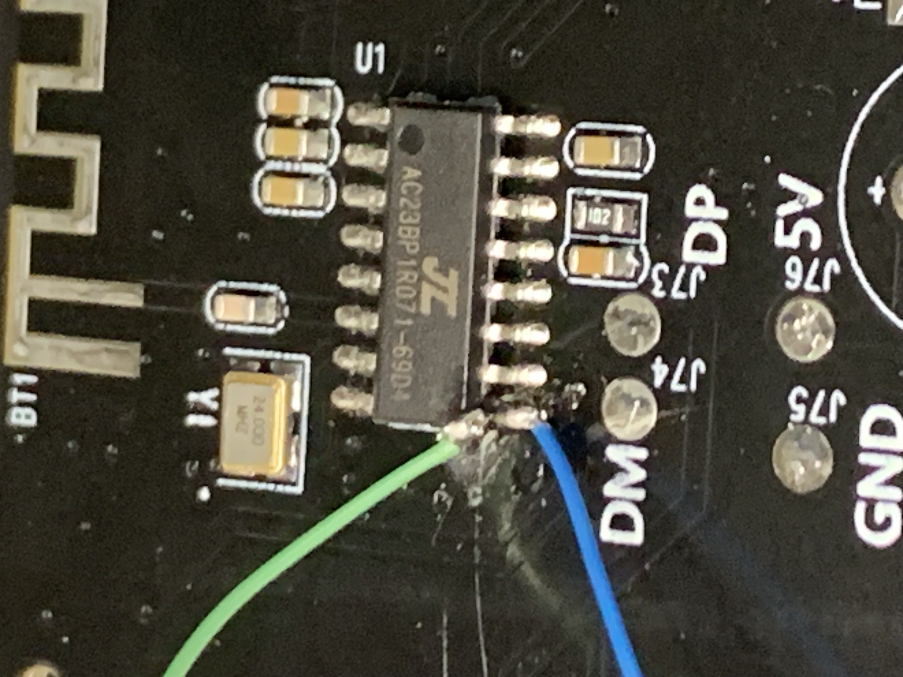
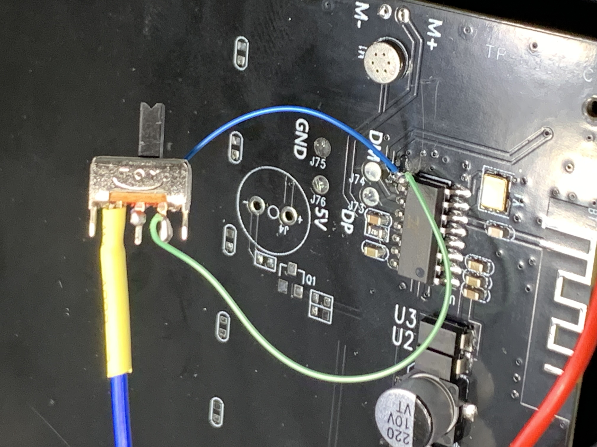
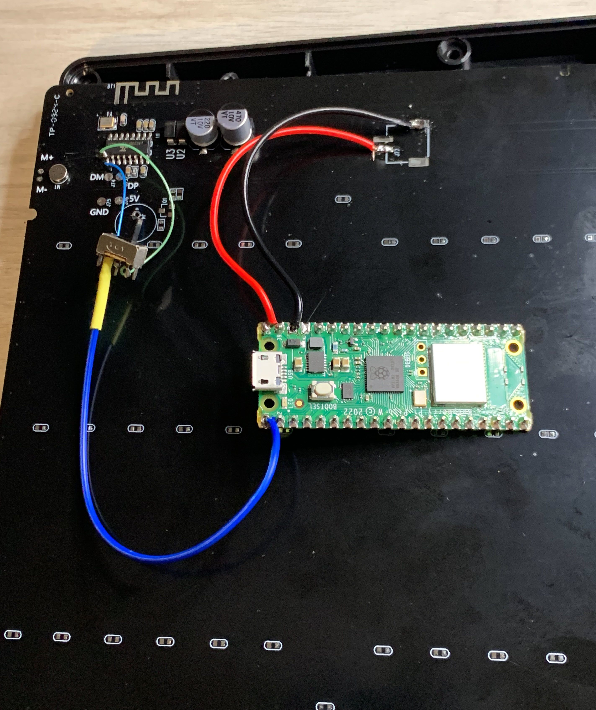
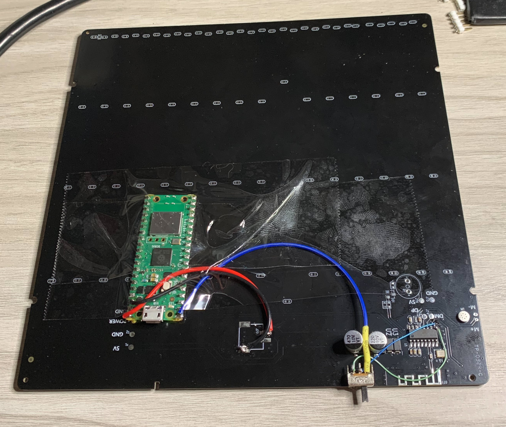

# Merkury Innovations Bluetooth Matrix LED Display

https://www.walmart.com/ip/Merkury-Innovations-Bluetooth-Matrix-LED-Pixel-Display/5150283693

The LEDs are a single strand of 256 neopixels. The circuit board has a single IC that handles
bluetooth and drives the LEDs.

I used a continuity checker to trace the first neopixel to pin 9 of the IC (U1).

I used a soldering iron to carefully lift pin 9 from the circuit board. I attached a blue wire to the
circuit board pad. This drives the neopixels. I attached a green wire to the lifted pin 9.

I added a SPDT switch to select the neopixel input: original or my raspberry pi pico.

I removed the existing USB power cable. I'll use a full USB cable that carries data (for programming) and
power. I wired the pico VBUS and GND to the circuit board where the old USB cable was attached.

The pico GP0 pin drives the neopixels.

I used a drop of superglue to mount the switch to the circuit board. Packing tape secures the pico to keep it
from sliding around.

I drilled a hole in the side of the case for access to the switch. I had to widen the existing USB cable hole
to push my new cable through. I plugged the USB into the pico, made sure everything was working, and 
reassembled the case.